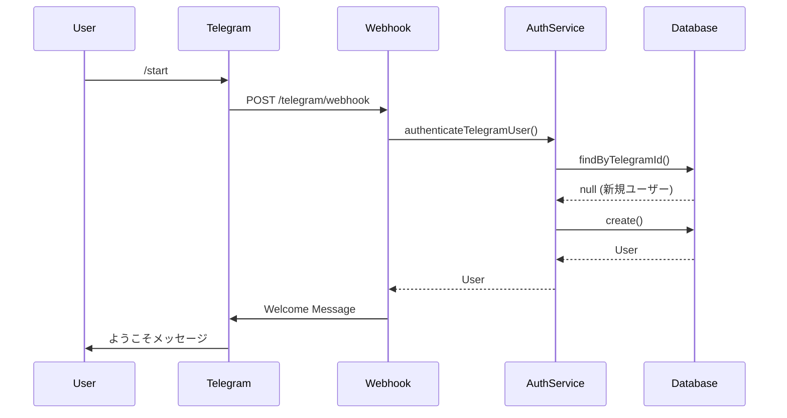
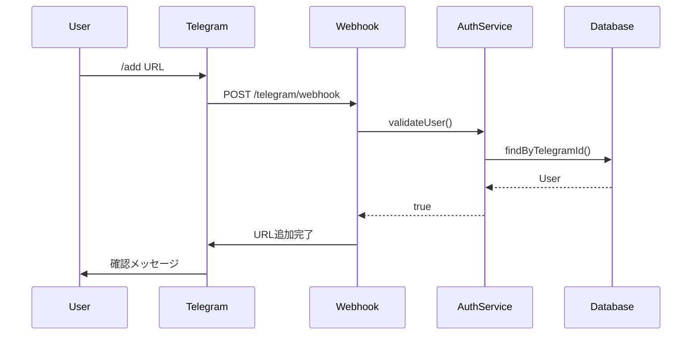

# Telegram認証システム

## 概要

本システムは、Telegram IDベースの認証システムを提供します。ユーザーはTelegramボットとの対話を通じて認証され、物件監視サービスを利用できます。

## アーキテクチャ

### 主要コンポーネント

1. **AuthService** - 認証ロジックの中核
2. **UsersService** - ユーザー管理
3. **TelegramController** - Webhookエンドポイント
4. **Guards** - セキュリティ層

## API仕様

### POST /telegram/webhook

Telegram Webhookエンドポイント

#### リクエスト

```json
{
  "update_id": 12345,
  "message": {
    "message_id": 1,
    "from": {
      "id": 123456789,
      "is_bot": false,
      "first_name": "太郎",
      "last_name": "田中",
      "username": "tanaka_taro",
      "language_code": "ja"
    },
    "chat": {
      "id": 123456789,
      "type": "private"
    },
    "date": 1234567890,
    "text": "/start"
  }
}
```

#### レスポンス

```json
{
  "ok": true
}
```

## 認証フロー

### 1. 初回認証（/start コマンド）



### 2. 既存ユーザー認証



## セキュリティ

### 1. Webhook署名検証

TelegramWebhookGuardによる署名検証：

```typescript
// 環境変数設定
TELEGRAM_SECRET_TOKEN=your_secret_token_here
```

- X-Telegram-Bot-Api-Secret-Token ヘッダーの検証
- 開発環境では検証をスキップ
- 本番環境では必須

### 2. レート制限

RateLimitGuardによるレート制限：

- **制限**: 30リクエスト/分/ユーザー
- **ウィンドウ**: 60秒
- **超過時**: HTTP 429 Too Many Requests

### 3. 入力検証

すべての入力データは検証されます：

```typescript
// 必須フィールド
- id: number (required)
- first_name: string (required, max 255)

// オプションフィールド
- last_name: string (max 255)
- username: string (max 255)
- language_code: string
```

## エラーハンドリング

### カスタム例外クラス

1. **TelegramAuthException** - 一般的な認証エラー
2. **UserRegistrationException** - ユーザー登録エラー
3. **InvalidTelegramDataException** - 無効なTelegramデータ

### エラーレスポンス例

```json
{
  "statusCode": 400,
  "message": "Telegram user first name is required",
  "error": "Bad Request"
}
```

## データベーススキーマ

### Users テーブル

```sql
CREATE TABLE users (
  id INTEGER PRIMARY KEY AUTOINCREMENT,
  telegramId TEXT UNIQUE NOT NULL,
  username TEXT,
  firstName TEXT NOT NULL,
  lastName TEXT,
  isActive BOOLEAN DEFAULT true,
  languageCode TEXT,
  settings JSON,
  lastActiveAt TIMESTAMP DEFAULT CURRENT_TIMESTAMP,
  createdAt TIMESTAMP DEFAULT CURRENT_TIMESTAMP,
  updatedAt TIMESTAMP DEFAULT CURRENT_TIMESTAMP
);

CREATE UNIQUE INDEX idx_users_telegramId ON users(telegramId);
```

### UserSettings 型定義

```typescript
interface UserSettings {
  notifications: {
    enabled: boolean;
    silent: boolean;
    timeRange?: {
      start: string;
      end: string;
    };
  };
  language: string;
  timezone?: string;
}
```

## コマンド一覧

| コマンド | 説明 | 例 |
|---------|------|-----|
| /start | ボットを開始/再開 | /start |
| /add | 監視URLを追加 | /add https://example.com |
| /list | 登録URL一覧を表示 | /list |
| /remove | URLを削除 | /remove 1 |
| /pause | 監視を一時停止 | /pause 1 |
| /resume | 監視を再開 | /resume 1 |
| /status | 監視状況を確認 | /status |
| /help | ヘルプを表示 | /help |

## テスト

### 単体テスト

```bash
# 認証サービステスト
npm run test auth.service

# コントローラーテスト  
npm run test telegram.controller

# ユーザーサービステスト
npm run test users.service
```

### 統合テスト

```bash
# 全体テスト実行
npm run test

# カバレッジレポート
npm run test:cov
```

## トラブルシューティング

### よくある問題

1. **Webhook接続エラー**
   - TELEGRAM_BOT_TOKEN が正しく設定されているか確認
   - ngrokなどでローカルをHTTPS公開しているか確認

2. **認証エラー**
   - Telegram IDが正しく送信されているか確認
   - first_nameが空でないか確認

3. **レート制限エラー**
   - 1分間に30回以上のリクエストを送信していないか確認

### ログ確認

```bash
# アプリケーションログ
tail -f logs/app.log

# エラーログのみ
grep ERROR logs/app.log
```

## 設定例

### 開発環境 (.env.development)

```env
NODE_ENV=development
TELEGRAM_BOT_TOKEN=123456:ABC-DEF1234ghIkl-zyx57W2v1u123ew11
TELEGRAM_SECRET_TOKEN=development_secret
LOG_LEVEL=debug
```

### 本番環境 (.env.production)

```env
NODE_ENV=production
TELEGRAM_BOT_TOKEN=<実際のトークン>
TELEGRAM_SECRET_TOKEN=<強力なランダム文字列>
LOG_LEVEL=info
RATE_LIMIT_WINDOW_MS=60000
RATE_LIMIT_MAX_REQUESTS=30
```

## メンテナンス

### データベースマイグレーション

```bash
# マイグレーション実行
npm run typeorm:run-migrations

# マイグレーション作成
npm run typeorm:generate-migration -- --name=UpdateUserEntity

# マイグレーションロールバック
npm run typeorm:revert-migration
```

### バックアップ

```bash
# SQLiteバックアップ
cp sokubutsu.sqlite sokubutsu.sqlite.backup

# PostgreSQLバックアップ
pg_dump sokubutsu_db > backup.sql
```

## 今後の拡張予定

1. **2要素認証（2FA）** - 追加のセキュリティ層
2. **セッション管理** - JWTトークンベース認証
3. **権限管理** - ロールベースアクセス制御
4. **監査ログ** - すべての認証イベントの記録
5. **メトリクス** - 認証成功率、レスポンスタイム等